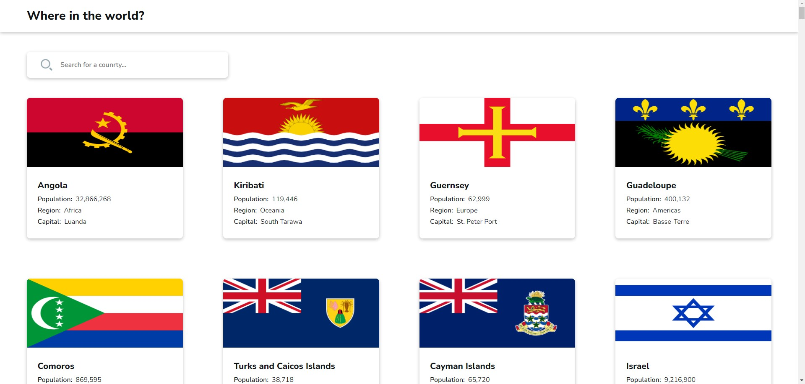
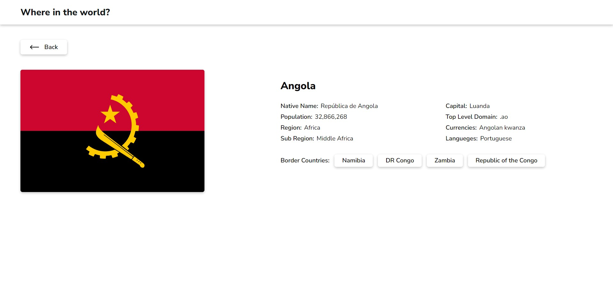

# rest-country

Country site built with React/Redux.

The website provides brief and informative profiles of each country in the world, designed for quick reference and easy browsing.
The goal of this challenge is to integrate with the [REST Countries API](https://gitlab.com/restcountries/restcountries) to pull country data and display it.

Users will be able to:

- See all countries from the API on the homepage
- Search for a country using an input field
- Click on a country to see more detailed information on a separate page
- Click through to the border countries on the detail page
- View the optimal layout for the interface depending on their device's screen size
